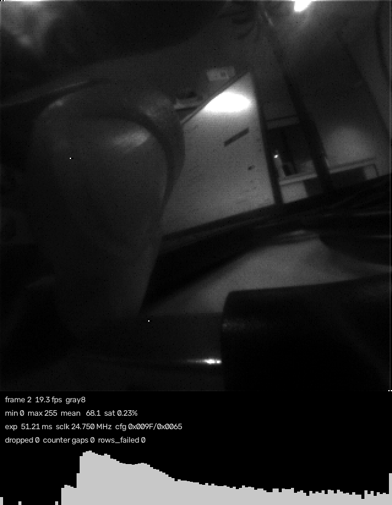
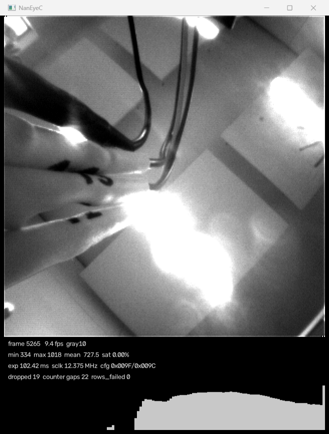

# NanEyeC on Teensy 4.1

320×320 mono frames from an ams-OSRAM NanEyeC, over the sensor's half-duplex single-ended
interface (SEIM), through a Teensy 4.1, to a PC over USB. Built for **measurement and image
capture**: 10-bit fidelity, per-frame timestamps, explicit dropped-frame accounting.

These pages are written for whoever picks this up next — most likely me, months later. They
assume the hardware is in front of you and skip the basics. Design rationale and the agreed
decisions live in the [design record](design.md); everything here is what you need to
operate, extend or debug the thing.

## Where the project stands

| | |
|---|---|
| Reference capture decoded | done — 7 frames, all 716,800 pixel words correctly framed |
| Host decode, transport, recorder, viewer | done, 42 tests passing, no hardware needed |
| Firmware | compiles clean; **has never run on hardware** |
| Bring-up M1 onward | blocked on wiring |

!!! warning "The firmware is unproven"
    Every line was written against the datasheets, AN000611 and a decoded capture of a
    working link — but no sensor has ever been attached. The register-level LPSPI setup is
    where the risk sits. Three things to doubt first, in order:

    1. whether a bare `TCR` write with `TXMSK=1` really starts a receive-only frame with no
       TX data,
    2. whether SDAT goes hi-Z fast enough at the INTERFACE→SYNC boundary,
    3. the exact clock accounting in `seim::start()`, where our clock counts and the
       sensor's internal state machine must agree to the bit.

    `SELFTEST` and `PROBE` exist so you can check the decode and the link separately,
    before trusting any image. See [bring-up](hardware.md#bring-up).

## The thing worth knowing first

Almost nothing here was derived from datasheet nominals. `doc/digital.csv` is a 434 MB
Saleae export of a **working** NanoBerry ↔ Raspberry Pi link, and it was decoded completely
before any code was written. That gave hard numbers for the clock rate, the sampling edge,
the exact register sequence, the one-frame latency on register writes, and a defect in the
reference implementation worth avoiding. Those measurements outrank the datasheet wherever
they disagree — see [SEIM reference](seim.md) and the [design record](design.md).

The whole of `doc/` is untracked — vendor datasheets, the schematic and the capture are
third-party or raw input rather than project source, and this repository is public. One real
row of the capture *is* committed, as `firmware/src/golden_vector.h`, which is what both the
on-device `SELFTEST` and the host tests check themselves against. `.gitignore` lists what to
put back in `doc/` and where it comes from.

## Quick start

```bash
uv sync
uv run python tools/decode_golden.py        # needs doc/digital.csv; ~50 s first run
uv run pytest                               # 42 tests
uv run --group firmware python -m platformio run -d firmware # build the firmware
```

No camera attached? The host stack replays reference frames through the real wire protocol,
so what the viewer receives is byte-for-byte what the Teensy would send:

```bash
uv run python -m naneye.viewer --source replay
```



With hardware, swap `--source replay` for `--source auto`:



## Map

| Page | What is in it |
|---|---|
| [Design record](design.md) | The living spec: decisions, measured ground truth, milestones, risks |
| [Hardware and bring-up](hardware.md) | Pin map, power, the staged bring-up with pass/fail checks |
| [Firmware architecture](firmware.md) | Phase sequencer, LPSPI3 + DMA, buffering, the rules that must not be broken |
| [Host usage and API](host.md) | Viewer, recorder, sources, the `naneye` package, recording format |
| [SEIM protocol reference](seim.md) | Word formats, frame phases, registers, exposure maths, measured timing |
| [Datasheet cross-check](datasheet-crosscheck.md) | Every place the code differs from the documentation, and why |

## Repository layout

```
spec.md                 living design record (rendered as "Design record" here)
docs/                   this site
doc/                    untracked: datasheets, schematic, reference capture
firmware/               PlatformIO project for the Teensy 4.1
host/naneye/            decoder, transport, sources, viewer, recorder
tools/                  golden-capture decoder, test-vector generator
tests/                  42 tests, none needing hardware
```

## Building these docs

```bash
uv sync --group docs
uv run mkdocs serve      # http://127.0.0.1:8000
uv run mkdocs build      # site/
```
